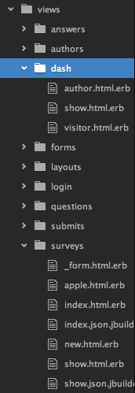

# Week 7 Homework Feedback

## Survey Opossum

We spent a lot of time in class on this one, but here are a few things:

#### Removing files and folders you don't need anymore

It's true that when you have extra files sitting around in Rails, they don't usually hurt anything.  However, they DO make it much harder for developers (including you) to (a) know where you're supposed to be working and (b) find bugs.

Here's an example of a file system that could use a lot of cleaning up:

#### Have a create view!

    def create
      @submission = Submission.new(submission_params)
      if @submission.save && @submission.survey.author.id == session[:author_id]
        redirect_to @submission, notice: 'Submission was successfully created.'
      elsif @submission.save
        redirect_to thankyou_submissions_path
      else
        redirect_to @submission.survey, notice: "All required questions must be answered."
      end
    end

    def thankyou
    end

####

    accepts_nested_attributes_for :questions, allow_destroy: true,
        reject_if: proc { |attributes| attributes['question_text'].blank? },
        reject_if: proc { |attributes| attributes['question_type'].blank? }

## Add JavaScript

#### Set timeouts

    function disabledButton(){
      var button = document.getElementById("submit-button");
      setTimeout(function(){ button.disabled = 'true'; }, 10);
    }

#### Load Order

    function hideLast(){
      var containers = document.getElementsByClassName("association container");
      var lastRow = containers[containers.length-1];
      console.log(containers);
      console.log(lastRow);
    }
    window.onload = hideLast;

####

    function hideMyField() {
      var sections = document.getElementsByClassName("association container");
      var lastsections = sections[sections.length-1];
        lastsections.color == green
      if(lastsections.style.display === 'block') {
        lastsections.style.display = 'none';
      }
      else{
        lastsections.style.display = 'block';
      }
    }
